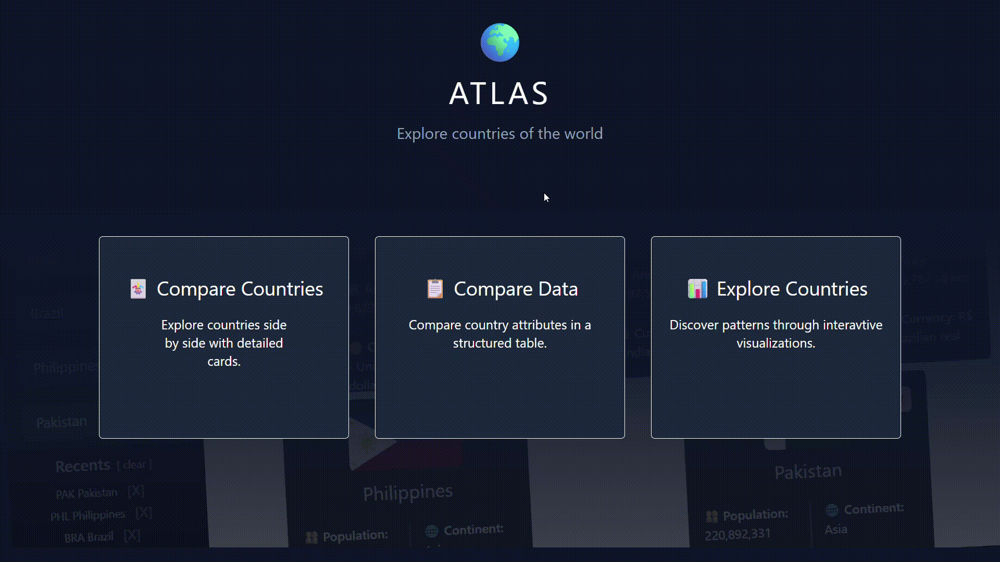
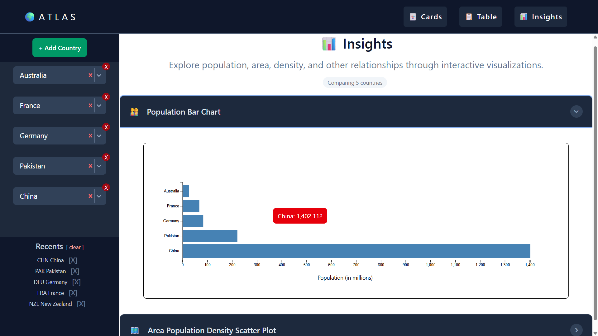
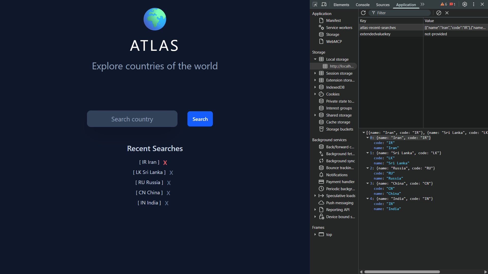
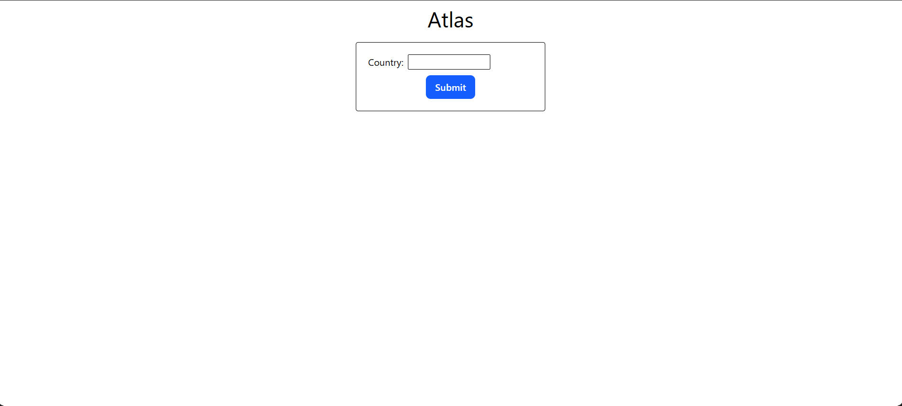
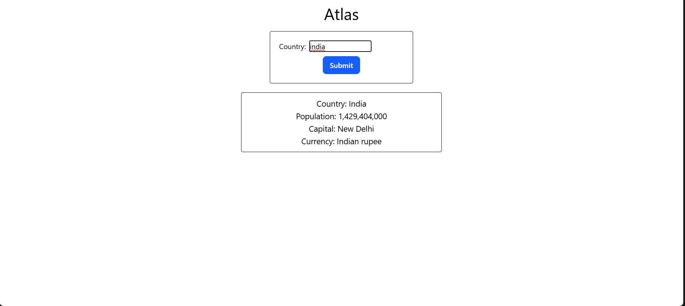

# 🌍 Atlas

### 🌐 **Live site:** [https://hrishikeshbajirao.github.io/atlas/](https://hrishikeshbajirao.github.io/atlas/)

Atlas is a Full-Stack React and Express application for exploring countries around the world.

Search for any country to instantly discover detailed information including its flag, population, capital, currencies, languages, area, region, time zones, and more.

---

## 🎥 Demo

<p align="center">
  
</p>

*A quick demonstration of Atlas: search countries, compare multiple countries, manage comparison slots, and use recent searches.*

## 🎥 Previous Demos

<details>
<summary><strong>📦 Older Atlas Demo</strong></summary>

<br>

### v0.5.0

<p align="center">
  
</p>

### v0.4.0

<p align="center">
  
</p>

</details>

---

## 📸 Screenshots

<details>
<summary><strong>🌟 v0.6.0 - Insights and Visualizations</strong></summary>

<br>

<p align="center">
  
  
  
  
  
</p>

Dynamic comparison panels, Card/Table/Insights views, and interactive D3.js visualizations.

</details>

<details>
<summary><strong>📦 Previous Versions</strong></summary>

<br>

<details>
<summary><strong>v0.5.0 - Enhanced Comparison Experience</strong></summary>

<br>

<p align="center">
  
  
</p>

Enhanced comparison workflow with searchable country selection.

</details>

<br>

<details>
<summary><strong>v0.4.0 - Dynamic Comparison</strong></summary>

<br>

<p align="center">
  
  
</p>

Dynamic multi-country comparison.

</details>

<br>

<details>
<summary><strong>v0.3.0 - Recent Searches</strong></summary>

<br>

<p align="center">
  
</p>

Persistent recent searches using localStorage.

</details>

<br>

<details>
<summary><strong>v0.2.0 - UI Redesign</strong></summary>

<br>

<p align="center">
  
  
</p>

Reusable components and improved interface.

</details>

<br>

<details>
<summary><strong>v0.1.0 - Initial Search</strong></summary>

<br>

<p align="center">
  
  
</p>

First working version using the REST Countries API.

</details>

</details>

## Version History

| Version | Release Date | Status | Highlights |
|---------|--------------|--------|------------|
| **v0.1.0** | Jul 20, 2026 | ✅ Released | Live country search, REST Countries API integration, loading state |
| **v0.2.0** | Jul 21, 2026 | ✅ Released | Component-based architecture, reusable UI components, responsive improvements |
| **v0.3.0** | Jul 22, 2026 | ✅ Released | Recent searches, localStorage persistence, clickable search history, delete history |
| **v0.4.0** | Jul 27, 2026 | ✅ Released | Dynamic comparison panels, add/remove slots, scalable architecture |
| **v0.5.0** | Aug 7, 2026  | ✅ Released | Advanced comparison table, searchable country selector, improved comparison experience |
| **v0.6.0** | Aug 21, 2026 | ✅ Released | Major UI redesign, Card/Table/Insights views, D3 visualizations, improved UX |
| **v0.7.0** | Aug 31, 2026 | ✅ Released | Express backend, historical GDP data, and interactive world visualization |
| **v1.0.0** | TBD | 🎯 Goal | Production-ready portfolio release |

---

## ✨ Features

- 🔍 Search and explore countries using autocomplete
- 🌍 Compare multiple countries across Card, Table, and Insights views
- 📊 Interactive D3.js visualizations for country data
- 🗺️ Interactive world choropleth for population density
- 📈 Historical GDP visualization across countries and years
- 💾 Persistent recent searches
- ⚡ Responsive and interactive user interface

---

## 🛠️ Tech Stack

### Frontend
- React
- Vite
- JavaScript (ES6+)
- Tailwind CSS
- D3.js

### Backend
- Node.js
- Express

### Data Sources
- countries.dev
- Our World in Data
- World Atlas

### Libraries and Packages
- React Select
- TopoJSON
- jsonwebtoken
- argon2
- Drizzle ORM

### Browser APIs
- Fetch API
- localStorage

---

### 🌐 Deployment

- **Frontend:** [GitHub Pages](https://hrishikeshbajirao.github.io/atlas/)
- **Backend API:** [Render](https://atlas-docker-container.onrender.com)
- **Postgre Database:** Neon

## Skills Demonstrated

- React component architecture & Hooks
- Dynamic state management
- REST API design and integration
- Node.js & Express backend development
- Asynchronous programming and data fetching
- Data transformation and normalization
- D3.js data visualization
- Reusable and scalable component design
- Responsive UI development with Tailwind CSS
- Client-side persistence with localStorage
- Environment-based configuration
- Full-stack application deployment

---

## 📈 Development Statistics

This project is actively maintained and tracked using GitHub and WakaTime.

<p align="center">

[](https://github.com/HrishikeshBajirao/atlas/commits/main)

[](https://wakatime.com/badge/user/7864a36e-34fb-462c-a73d-d8c410aed4dc/project/07504929-ef89-4d0d-b2d1-7784474d4795)

</p>

---

## Installation

```bash
git clone https://github.com/HrishikeshBajirao/atlas

cd atlas/client

npm install

npm run dev
```

---

## Project Goals

Atlas is more than a country information app. It serves as a hands-on learning project to practice:

- Building reusable React components
- Managing application state
- Working with REST APIs
- Persisting data with localStorage
- Creating responsive user interfaces
- Writing maintainable and scalable code
- Following professional Git workflows with feature branches and semantic versioning

---

## Roadmap

See the project's **ROADMAP.md** for upcoming features and planned releases.

---

## License

This project is open source and intended for learning and portfolio purposes.