# 🌍 Atlas

Atlas is a modern React application for exploring countries around the world.

Search for any country to instantly discover detailed information including its flag, population, capital, currencies, languages, area, region, time zones, and more.

Atlas is being built as a portfolio project while learning modern frontend development with React, focusing on clean architecture, reusable components, and an excellent user experience.

---

## 🎥 Demo

<p align="center">
  
</p>

*A quick demonstration of Atlas: search countries, compare multiple countries, manage comparison slots, and use recent searches.*

## 🎥 Previous Demos

<details>
<summary><strong>📦 Older Atlas Demo</strong></summary>

<br>

### v0.5.0

<p align="center">
  
</p>

### v0.4.0

<p align="center">
  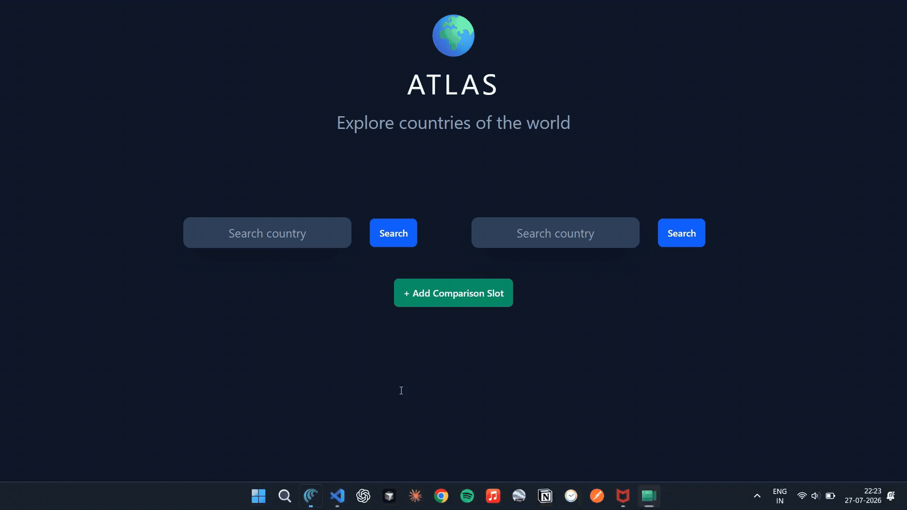
</p>

</details>

---

## 📸 Screenshots

<details>
<summary><strong>🌟 v0.6.0 - Insights and Visualizations</strong></summary>

<br>

<p align="center">
  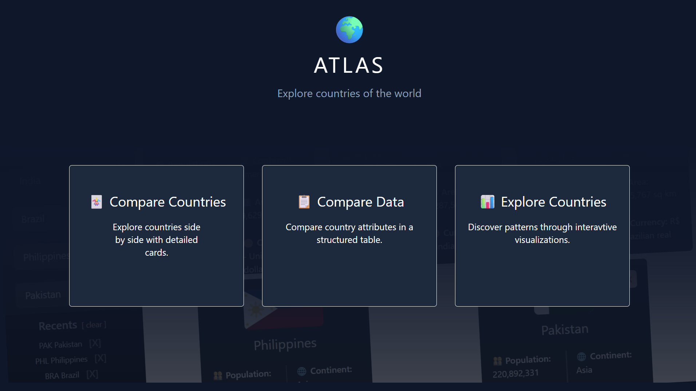
  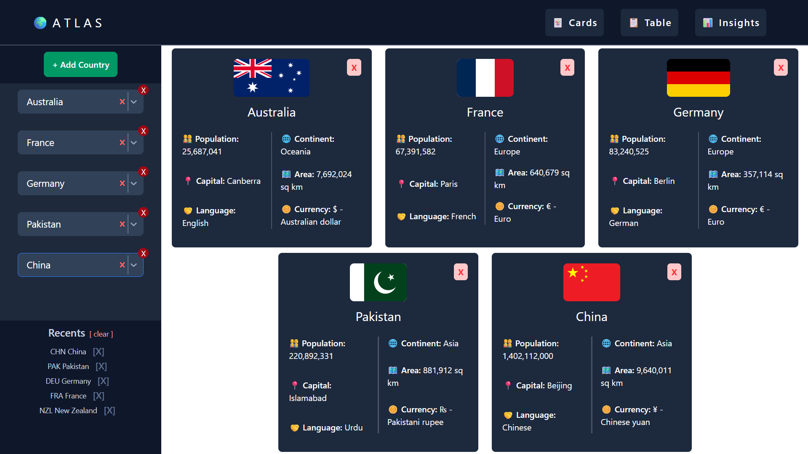
  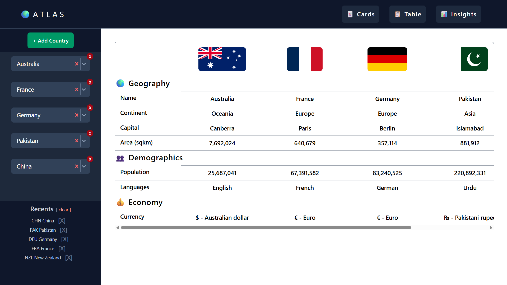
  
  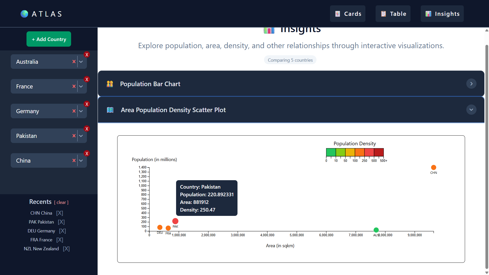

</p>

Dynamic comparison panels with independent state management.

</details>

---

<details>
<summary><strong>🌟 v0.5.0 — Enhanced Comparison Experience</strong></summary>

<br>

<p align="center">
  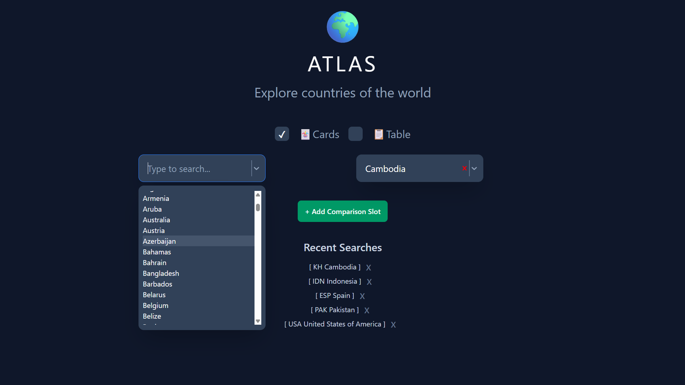
  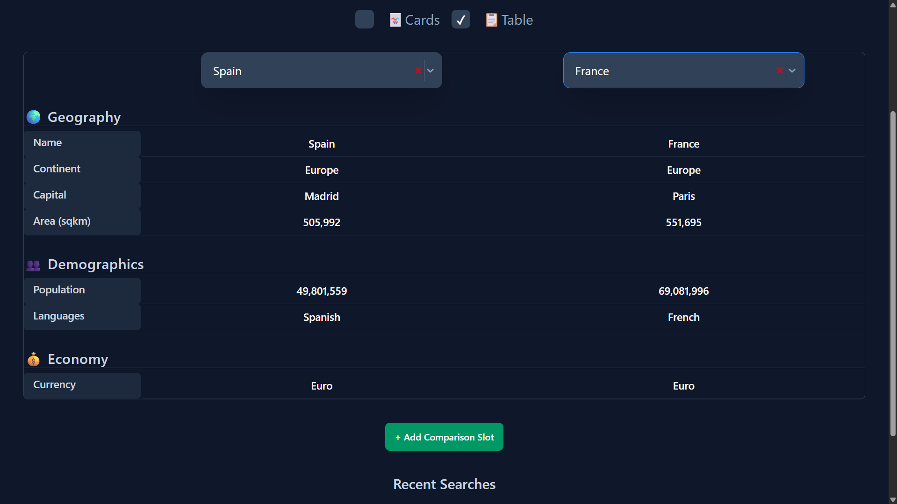
</p>

Dynamic comparison panels with independent state management.

</details>

---

<details>
<summary><strong>🌟 v0.4.0 — Dynamic Comparison</strong></summary>

<br>

<p align="center">
  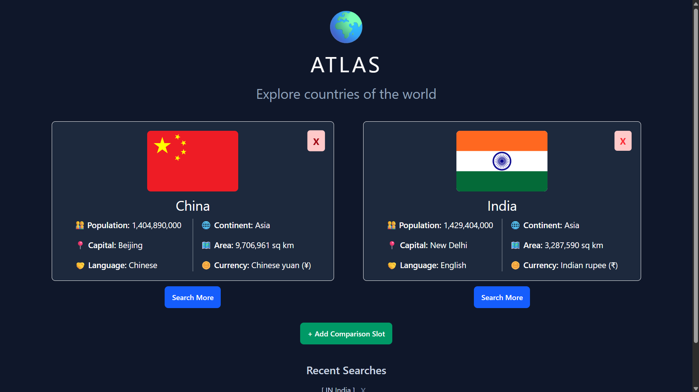
  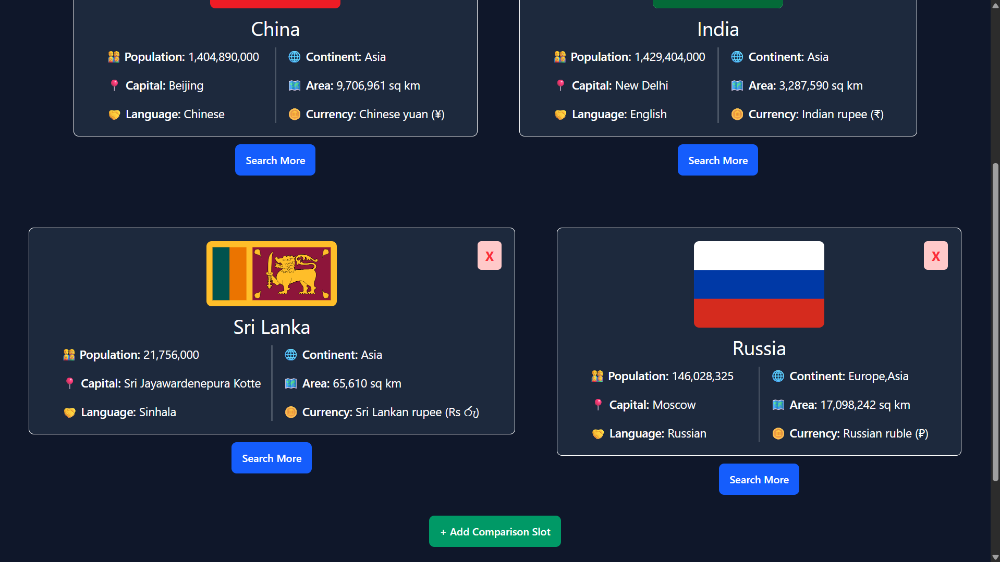
</p>

Dynamic comparison panels with independent state management.

</details>

---

<details>
<summary><strong>💾 v0.3.0 — Recent Searches using localStorage API</strong></summary>

<br>

<p align="center">
  
</p>

Persistent search history using localStorage.

</details>

---

<details>
<summary><strong>🎨 v0.2.0 — UI Redesign</strong></summary>

<br>

<p align="center">
  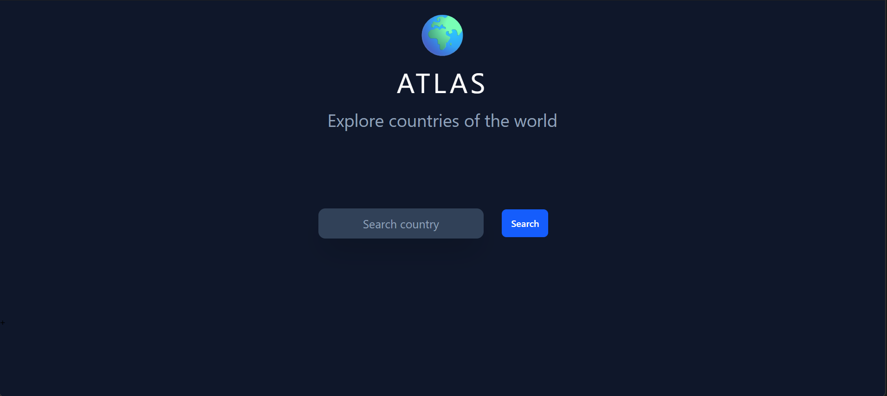
  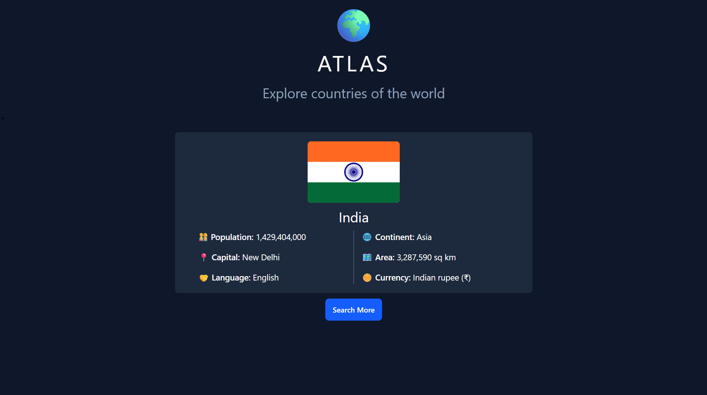
</p>

Reusable components and improved interface.

</details>

---

<details>
<summary><strong>🚀 v0.1.0 — Initial Search</strong></summary>

<br>

<p align="center">
  
  
</p>

First working version using the REST Countries API.

</details>

## Version History

| Version | Release Date | Status | Highlights |
|---------|--------------|--------|------------|
| **v0.1.0** | Jul 20, 2026 | ✅ Released | Live country search, REST Countries API integration, loading state |
| **v0.2.0** | Jul 21, 2026 | ✅ Released | Component-based architecture, reusable UI components, responsive improvements |
| **v0.3.0** | Jul 22, 2026 | ✅ Released | Recent searches, localStorage persistence, clickable search history, delete history |
| **v0.4.0** | Jul 27, 2026 | ✅ Released | Dynamic comparison panels, add/remove slots, scalable architecture |
| **v0.5.0** | Aug 7, 2026  | ✅ Released | Advanced comparison table, searchable country selector, improved comparison experience |
| **v0.6.0** | Aug 21, 2026 | ✅ Released | Major UI redesign, Card/Table/Insights views, D3 visualizations, improved UX |
| **v1.0.0** | TBD | 🎯 Goal | Production-ready portfolio release |

---

## ✨ Features

- 🔍 Search countries using autocomplete
- 🌍 Explore detailed country information
- 🃏 Card View for visual country exploration
- 📋 Table View for structured country comparison
- 📊 Insights View for data visualization
- 📈 Interactive D3.js visualizations
- 📊 Population comparison
- 🔵 Population vs. area scatter plot
- 🎨 Population-density visualization
- 💬 Interactive chart tooltips
- 📐 Dynamic comparison slots
- 💾 Persistent recent searches using localStorage
- ➕ Add and remove comparison slots
- ❌ Remove individual recent searches
- ⏳ Loading and error states
- 🛡️ Protection against stale/out-of-order API responses
- ✨ Animated transitions and hover interactions
- 📱 Responsive interface

---

## 🛠️ Tech Stack

### Frontend
- React
- Vite
- JavaScript (ES6+)
- Tailwind CSS
- D3.js

### APIs
- countries.dev

### Libraries
- React Select

### Browser APIs
- Fetch API
- localStorage

---

## Skills Demonstrated

- React component architecture & Hooks
- Dynamic state management
- REST API integration & asynchronous programming
- Reusable and scalable component design
- Third-party library integration (react-select)
- Responsive UI development with Tailwind CSS
- Client-side persistence using localStorage
- Modern JavaScript (ES6+)

---

## 📈 Development Statistics

This project is actively maintained and tracked using GitHub and WakaTime.

<p align="center">

[](https://github.com/HrishikeshBajirao/atlas/commits/main)

[](https://wakatime.com/badge/user/7864a36e-34fb-462c-a73d-d8c410aed4dc/project/07504929-ef89-4d0d-b2d1-7784474d4795)

</p>

---

## Installation

```bash
git clone <repository-url>

cd atlas

npm install

npm run dev
```

---

## Project Goals

Atlas is more than a country information app. It serves as a hands-on learning project to practice:

- Building reusable React components
- Managing application state
- Working with REST APIs
- Persisting data with localStorage
- Creating responsive user interfaces
- Writing maintainable and scalable code
- Following professional Git workflows with feature branches and semantic versioning

---

## Roadmap

See the project's **ROADMAP.md** for upcoming features and planned releases.

---

## License

This project is open source and intended for learning and portfolio purposes.